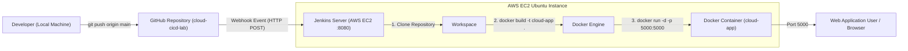

# CSE30040 — Cloud Computing and DevOps
## Experiment 5: CI/CD Pipeline Using Jenkins

**Course:** CSE30040 — Cloud Computing and DevOps  
**Experiment No:** 5  
**Prepared for:** Prof. Priya Nagargoje  
**Student Name:** [Your Name]  
**Roll No / Registration No:** [Your Roll No]  
**Academic Year:** 2026 – 2027  
**Date of Submission:** 25 September 2026  

---

## 1. Objective
To design, implement, and verify an automated Continuous Integration and Continuous Deployment (CI/CD) pipeline using **GitHub**, **Jenkins**, **Docker**, and **AWS EC2**.

---

## 2. Theory

DevOps combines software development (Dev) and IT operations (Ops) to shorten the systems development life cycle and provide continuous delivery with high software quality. Continuous Integration (CI) and Continuous Deployment/Delivery (CD) form the backbone of modern DevOps automation.

### Key Concepts:
1. **Continuous Integration (CI):**  
   The software development practice where developers regularly merge their code changes into a central repository (e.g., GitHub), after which automated builds and tests are run. The key goal is to find and address bugs earlier, improve software quality, and reduce the time it takes to validate and release new software updates.
2. **Continuous Deployment (CD):**  
   Continuous Deployment extends CI by automatically deploying every change that passes all stages of the production pipeline directly to production or staging environments without manual human intervention.
3. **Jenkins:**  
   An open-source automation server that facilitates building, testing, and deploying software. Jenkins enables developers to set up CI/CD pipelines as code via declarative or scripted pipelines.
4. **Jenkins Pipeline & Jenkinsfile:**  
   A suite of plugins that supports implementing and integrating continuous delivery pipelines into Jenkins. A `Jenkinsfile` is a text file containing the definition of a Jenkins Pipeline, checked into source control.
5. **GitHub Webhooks:**  
   An event-driven mechanism that sends HTTP POST payloads to external endpoints (such as Jenkins `/github-webhook/`) whenever repository events occur (e.g., `git push`), triggering automated builds instantly.
6. **Role of Docker in CI/CD:**  
   Docker containerizes the application, encapsulating the application code, runtime environment (Python 3.11), system libraries, and dependencies into an immutable image. This eliminates the "works on my machine" problem, ensuring consistency across development, testing, and production servers.

---

## 3. System Architecture



---

## 4. Software & Tools Required

| Tool / Technology | Version / Specification | Purpose in Experiment |
| :--- | :--- | :--- |
| **GitHub** | Cloud Git Repository | Remote version control and Webhook event dispatcher |
| **AWS EC2** | Ubuntu 22.04 LTS (t2.micro / t3.small) | Cloud host virtual machine running Jenkins & Docker |
| **Jenkins** | 2.440+ (LTS) | Automation CI/CD orchestrator |
| **Docker** | Community Edition 24+ | Containerization engine for packaging and running the app |
| **Python** | 3.11 | Application programming language |
| **Flask** | 3.0.0 | Lightweight Python web framework |
| **Git** | 2.40+ | Local version control management |

---

## 5. Source Code

### 5.1 `app.py`
```python
from flask import Flask, render_template_string
import socket
import os

app = Flask(__name__)

HTML_TEMPLATE = """
<!DOCTYPE html>
<html lang="en">
<head>
    <meta charset="UTF-8">
    <title>Cloud DevOps Lab - Flask Application</title>
    <style>
        body { font-family: Arial, sans-serif; background: #0f172a; color: #f8fafc; text-align: center; padding-top: 60px; }
        .card { background: #1e293b; max-width: 600px; margin: 0 auto; padding: 40px; border-radius: 12px; border: 1px solid #334155; }
        h1 { color: #38bdf8; margin-bottom: 12px; }
        .badge { background: #10b981; color: white; padding: 8px 18px; border-radius: 20px; font-weight: bold; display: inline-block; margin: 15px 0; }
        .info { background: #0f172a; padding: 15px; border-radius: 8px; margin-top: 20px; font-family: monospace; text-align: left; }
    </style>
</head>
<body>
    <div class="card">
        <h1>🚀 Welcome to Cloud CI/CD Lab!</h1>
        <p>Application deployed successfully via <b>Jenkins</b> & <b>Docker</b> on <b>AWS EC2</b>.</p>
        <div class="badge">● Version {{ version }} (Live Deployment)</div>
        <div class="info">
            <div>• Hostname: {{ hostname }}</div>
            <div>• Cloud Server: AWS EC2 Ubuntu 22.04 LTS</div>
            <div>• Container: Docker (cloud-app)</div>
            <div>• Port: 5000</div>
        </div>
    </div>
</body>
</html>
"""

@app.route('/')
def home():
    hostname = socket.gethostname()
    version = os.environ.get("APP_VERSION", "1.0")
    return render_template_string(HTML_TEMPLATE, hostname=hostname, version=version)

if __name__ == '__main__':
    app.run(host='0.0.0.0', port=5000, debug=False)
```

### 5.2 `requirements.txt`
```text
Flask==3.0.0
Werkzeug==3.0.1
```

### 5.3 `Dockerfile`
```dockerfile
# Step 2: Create Dockerfile
FROM python:3.11
WORKDIR /app
COPY . .
RUN pip install -r requirements.txt
EXPOSE 5000
CMD ["python", "app.py"]
```

### 5.4 `Jenkinsfile`
```groovy
pipeline {
    agent any
    stages {
        stage('Clone') {
            steps {
                git 'https://github.com/alex-devops/cloud-cicd-lab.git'
            }
        }
        stage('Build') {
            steps {
                sh 'docker build -t cloud-app .'
            }
        }
        stage('Deploy') {
            steps {
                sh '''
                docker stop cloud-app || true
                docker rm cloud-app || true
                docker run -d --name cloud-app -p 5000:5000 cloud-app
                '''
            }
        }
    }
}
```

---

## 6. Step-by-Step Implementation Procedure

### Step 1: Create Sample Flask Application
1. Create a project directory:
   ```bash
   mkdir cloud-cicd-lab
   cd cloud-cicd-lab
   ```
2. Write `app.py` and `requirements.txt`.
3. Test locally using `python app.py` on port 5000.

### Step 2: Create Dockerfile
Create a `Dockerfile` specifying the Python 3.11 base image, copy source files, install dependencies via `pip`, expose port 5000, and define the entry point command `["python", "app.py"]`.

### Step 3: Initialize Git and Push to GitHub
1. Initialize git and commit:
   ```bash
   git init
   git add .
   git commit -m "Initial Commit"
   ```
2. Create remote repository on GitHub:
   ```bash
   git remote add origin https://github.com/alex-devops/cloud-cicd-lab.git
   git branch -M main
   git push -u origin main
   ```

### Step 4: Install Jenkins and Docker on AWS EC2
Launch an Ubuntu 22.04 LTS EC2 instance with Security Group rules permitting:
- Port 22 (SSH)
- Port 8080 (Jenkins UI)
- Port 5000 (Flask Web Application)

Execute the setup commands:
```bash
sudo apt update
sudo apt install openjdk-17-jdk -y
sudo apt install jenkins -y
sudo systemctl start jenkins
sudo systemctl enable jenkins
sudo apt install docker.io -y
sudo systemctl start docker
sudo systemctl enable docker
sudo usermod -aG docker jenkins
sudo systemctl restart jenkins
```

### Step 5: Configure Jenkins Pipeline
1. Log in to Jenkins at `http://<EC2-PUBLIC-IP>:8080`.
2. Click **New Item** &rarr; Name: `cloud-cicd-pipeline` &rarr; Type: **Pipeline**.
3. Under **Build Triggers**, check `GitHub hook trigger for GITScm polling`.
4. Under **Pipeline Definition**, select **Pipeline script** and insert the Declarative Pipeline script.
5. Click **Save**.

### Step 6: Execute Pipeline
Click **Build Now** in Jenkins. Monitor the Pipeline Stage View:
- **Clone:** Clones code from GitHub repository.
- **Build:** Executes `docker build -t cloud-app .`.
- **Deploy:** Stops old container, removes it, and runs new container on port 5000.

### Step 7 & 8: Verify Deployment & Output
1. Run `docker ps` on EC2 to verify the `cloud-app` container is running.
2. Open `http://<EC2-PUBLIC-IP>:5000` in browser to see the live Flask application.

### Step 9: Configure GitHub Webhook
1. Go to GitHub Repository &rarr; **Settings** &rarr; **Webhooks** &rarr; **Add Webhook**.
2. **Payload URL:** `http://<EC2-PUBLIC-IP>:8080/github-webhook/`
3. **Content type:** `application/json`
4. Select `Just the push event` & Check `Active`.
5. Click **Add webhook** and verify green checkmark (`200 OK`).

### Step 10: Verify Automatic Deployment (Version 2)
1. Edit `app.py` to Version 2.0.
2. Commit and push:
   ```bash
   git add .
   git commit -m "Version 2"
   git push origin main
   ```
3. GitHub automatically triggers Jenkins Build #2.
4. Refresh the browser at `http://<EC2-PUBLIC-IP>:5000` to verify the updated Version 2 without manual intervention.

---

## 7. Screenshots & Observations

### Screenshot 1: GitHub Repository

*Observation: GitHub repository `cloud-cicd-lab` populated with `app.py`, `Dockerfile`, `Jenkinsfile`, `requirements.txt`, and `README.md`.*

---

### Screenshot 2: Flask Application

*Observation: Source code of `app.py` in VS Code with local testing verified on port 5000.*

---

### Screenshot 3: Dockerfile

*Observation: Multi-instruction Dockerfile configuring Python 3.11, dependency installation, and container entrypoint.*

---

### Screenshot 4: Jenkins Dashboard

*Observation: Jenkins management console with `cloud-cicd-pipeline` job created, showing blue status ball (Success) and sunny weather icon.*

---

### Screenshot 5: Jenkins Pipeline Configuration

*Observation: Pipeline configuration with `GitHub hook trigger for GITScm polling` checked and declarative Groovy pipeline stages (Clone, Build, Deploy).*

---

### Screenshot 6: Successful Pipeline Build

*Observation: Stage View showing all 3 stages (Clone, Build, Deploy) completed with green SUCCESS badges, and console output displaying `Finished: SUCCESS`.*

---

### Screenshot 7: Running Docker Container

*Observation: Ubuntu EC2 bash terminal executing `docker ps`, showing container `cloud-app` active and mapped to port `0.0.0.0:5000->5000/tcp`.*

---

### Screenshot 8: Application Output

*Observation: Web browser accessing `http://<EC2-IP>:5000/`, displaying the running Flask web application (Version 1.0).*

---

### Screenshot 9: GitHub Webhook Configuration

*Observation: GitHub repository Webhook settings displaying Payload URL `http://<EC2-IP>:8080/github-webhook/`, active status, and successful HTTP 200 OK delivery.*

---

### Screenshot 10: Automatic Deployment Verification

*Observation: End-to-end verification showing `git push` triggering Jenkins Build #2 automatically via webhook, and browser reflecting updated Version 2.0 without manual intervention.*

---

## 8. Answers to Viva Questions

### Q1. What is Continuous Integration (CI)?
**Answer:**  
Continuous Integration (CI) is a software development practice where developers merge their working code copies into a shared mainline repository multiple times a day. Each integration triggers an automated build and test sequence (e.g., in Jenkins), enabling development teams to detect integration issues, syntax errors, and test regressions early, drastically shortening the debug cycle.

### Q2. What is Continuous Deployment (CD)?
**Answer:**  
Continuous Deployment (CD) is an automated release process in which every code change that passes all stages of the CI pipeline (linting, compilation, automated unit/integration testing) is automatically deployed directly to the production environment without manual approvals. It differs from *Continuous Delivery*, which requires a manual trigger/approval before promoting to production.

### Q3. What is Jenkins?
**Answer:**  
Jenkins is a leading open-source automation server written in Java. It provides hundreds of plugins supporting the building, deploying, and automating of software projects. Jenkins acts as the central coordinator in DevOps workflows, integrating with version control systems (GitHub), container platforms (Docker), cloud infrastructure (AWS), and testing frameworks.

### Q4. What is a Jenkins Pipeline?
**Answer:**  
A Jenkins Pipeline is a suite of plugins that supports implementing and integrating continuous delivery pipelines into Jenkins. It provides an extensible set of tools for modeling delivery pipelines "as code" via either Declarative Pipeline syntax or Scripted Pipeline syntax.

### Q5. What is a Jenkinsfile?
**Answer:**  
A `Jenkinsfile` is a plain text file checked into the root of the source code repository that contains the entire pipeline definition (stages, steps, agents, triggers, post-actions). Treating the pipeline definition as code enables version control, peer code reviews, auditing, and branching parity for CI/CD workflows.

### Q6. What is the role of Docker in CI/CD?
**Answer:**  
Docker solves the environment drift and consistency challenge ("works on my machine, fails in production") by packaging the application together with its runtime environment, system libraries, and dependencies into an immutable container image. In CI/CD:
- In the **Build stage**, Docker builds an identical image anywhere.
- In the **Test stage**, tests run in disposable, isolated containers.
- In the **Deploy stage**, Docker runs the containerized image on target servers (EC2) with zero host environment pollution.

### Q7. What is GitHub Webhook?
**Answer:**  
A GitHub Webhook is an HTTP-based event notification mechanism. When an event occurs in a GitHub repository (such as `git push`, pull request open/merge, release tag), GitHub sends an HTTP `POST` request with JSON payload to a specified endpoint URL (e.g., `http://<EC2-IP>:8080/github-webhook/`). Jenkins listens to this endpoint and instantly starts the designated pipeline without requiring periodic polling.

### Q8. What happens when a pipeline fails?
**Answer:**  
When a step or stage in a pipeline encounters a non-zero exit code or fails an assertion:
1. The pipeline immediately halts further execution of downstream stages (e.g., deployment is aborted).
2. The stage and overall build are marked with a Red / FAILED status.
3. Jenkins executes configured `post { failure { ... } }` blocks, which can send alerts (Email, Slack, Discord) to the responsible committer.
4. The running production environment remains untouched, preventing defective code from reaching end users.

### Q9. What are the benefits of CI/CD?
**Answer:**  
- **Faster Time to Market:** Features and bug fixes reach users in minutes rather than weeks.
- **Smaller, Lower-Risk Releases:** Incremental updates reduce code conflict complexity.
- **Early Bug Detection:** Integration issues are caught within minutes of committing.
- **Elimination of Human Error:** Manual FTP/SSH deployments and repetitive manual steps are eliminated.
- **High Consistency & Reliability:** Automated testing and immutable container deployments guarantee uniform results.

### Q10. What is DevOps?
**Answer:**  
DevOps is a set of cultural philosophies, practices, and tools that combines Software Development (**Dev**) and Information Technology Operations (**Ops**). Its purpose is to shorten the systems development life cycle while delivering features, fixes, and updates frequently, reliably, and in close alignment with business objectives. Key pillars include automation, continuous feedback, shared responsibility, and infrastructure as code.

---

## 9. Result
Successfully implemented an end-to-end Continuous Integration and Continuous Deployment (CI/CD) pipeline using **GitHub**, **Jenkins**, **Docker**, and **AWS EC2**. The application was automatically built and deployed whenever changes were pushed to the GitHub repository, and automatic deployment was verified with Version 1 and Version 2 releases.

---

## 10. References
- AWS Documentation — Jenkins & GitHub Pipeline Tutorial (AWS CodePipeline / EC2)
- Jenkins User Documentation — Pipeline Syntax & Declarative Pipelines (`https://www.jenkins.io/doc/book/pipeline/`)
- Docker Documentation — Get Started with Docker Containerization (`https://docs.docker.com/get-started/`)
- Flask Documentation — Deploying Flask Web Applications (`https://flask.palletsprojects.com/`)
